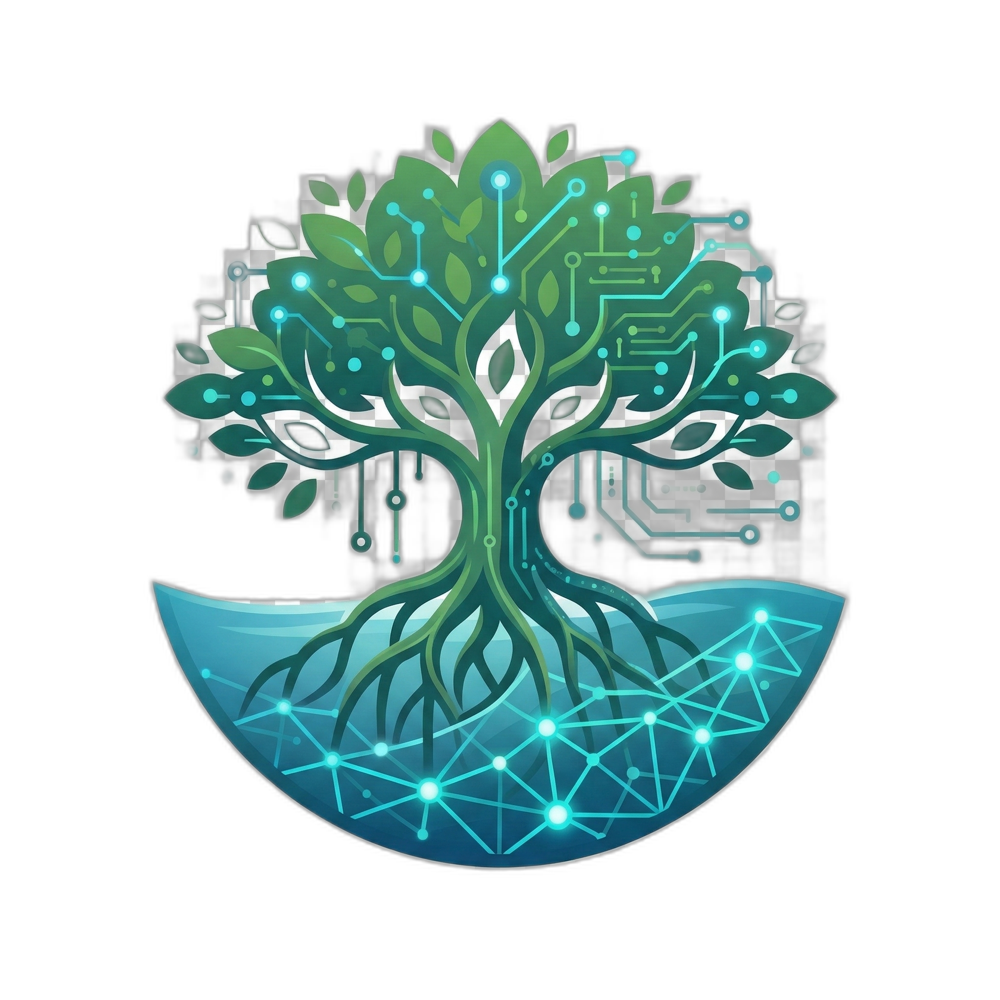

<p align="center">
  
</p>

<p align="center">
  
  
  
  
  
</p>

<h1 align="center">🌊 Coastal Sentinel — Web Platform</h1>
<h3 align="center">Production Cloud Monitoring & Landscape Intelligence for UAE Blue Carbon</h3>

<p align="center">
  <strong>Frontend Application for the Mangrove Carbon Intelligence Platform (MCIP)</strong><br>
  <em>MSc Data Science & AI Thesis Project | Middlesex University Dubai</em>
</p>

---

## 🌟 Overview

**Coastal Sentinel** is the client-facing production web application of MCIP. Built on **Next.js 15 (App Router)** and **Firebase Firestore** (`me-central1` UAE Sovereign Cloud), it delivers an institutional-grade interface for environmental ministries, carbon auditors, and coastal rangers to continuously monitor 40,000+ hectares of UAE coastal mangroves.

### Core Modules:
- **Interactive GIS Map (`/map`):** Real-time spatial visualization of 25 DBSCAN mangrove patch nodes, directional tidal flow vectors, and live health score heatmaps.
- **Analytics & Forecaster (`/analytics`):** Dynamic 69-month historical time-series analytics and 12-month Spatio-Temporal Graph Neural Network (ST-GNN) carbon forecasts with empirical confidence bands.
- **Autonomous Alert Engine (`/alerts`, `/alerts/featured`):** Three-tier automated ecological risk alert engine (Level 1 Info, Level 2 Warning + SHAP, Level 3 Critical).
- **Explainable AI Co-Pilot (`/xai`):** Multi-turn natural language landscape assistant synthesizing satellite data, weather reanalysis, and SHAP causal attribution.
- **Verra VM0033 Compliance Reporting (`/reports`):** 1-Click automated generator for auditor-ready, tamper-evident PDF certification dossiers.
- **National Registry (`/carbon`, `/impact`):** Three-stage carbon credit ledger (Internal $\rightarrow$ UAE Verified $\rightarrow$ Globally Certified).

---

## 🚀 Quick Start & Local Setup

### Prerequisites:
- Node.js ≥ 18.18.0
- npm or pnpm

### 1. Install Dependencies:
```bash
npm install
```

### 2. Configure Environment:
Copy `.env.example` to `.env.local` and add your Google Gemini API key:
```bash
cp .env.example .env.local
```

```env
GEMINI_API_KEY=your_gemini_api_key_here
GOOGLE_GENAI_API_KEY=your_gemini_api_key_here
GOOGLE_API_KEY=your_gemini_api_key_here
NEXT_PUBLIC_BACKEND_URL=http://localhost:8000
```

### 3. Run Locally:
```bash
npm run dev
```
Open [http://localhost:3000](http://localhost:3000) to view the application.

---

## ☁️ Vercel Deployment (1-Click)

This repository is optimized for zero-configuration deployment on **Vercel**:

1. Import this repository in [Vercel](https://vercel.com/new).
2. Framework Preset: **Next.js**.
3. Root Directory: `./` (Leave as default).
4. Environment Variables:
   - Add `GEMINI_API_KEY`, `GOOGLE_GENAI_API_KEY`, and `GOOGLE_API_KEY`.
   - Add `NEXT_PUBLIC_BACKEND_URL` pointing to your deployed backend API URL.
5. Click **Deploy**! Build completes in ~30 seconds.

---

## 🛡 Security & Compliance

- **Zero Secrets Committed:** All credentials are kept in `.env.local` and excluded by `.gitignore`.
- **Data Sovereignty:** Backed by Google Cloud `me-central1` (Doha), adhering strictly to UAE Federal Decree-Law No. 45/2021.
- **Role-Based Rules:** Governed by `firestore.rules` for fine-grained database access control.
